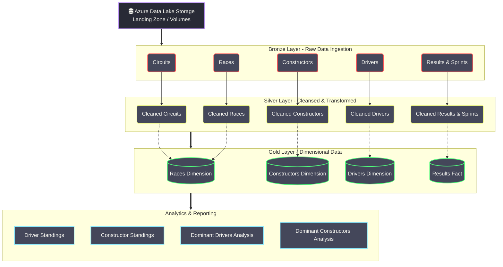
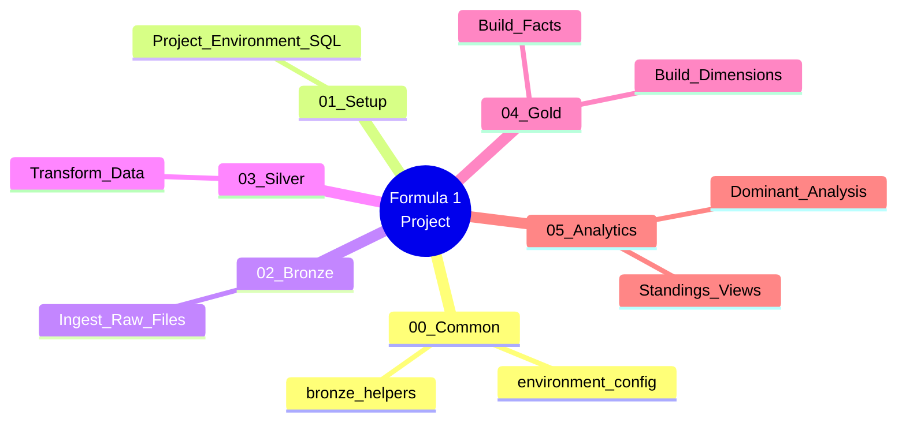

# Formula 1 Data Engineering Project (Azure Databricks)

This repository contains a complete Data Engineering project built using **Azure Databricks**, **PySpark**, and **Unity Catalog** to process and analyze Formula 1 data. The project follows the **Medallion Architecture** (Bronze, Silver, and Gold layers) for structuring data in the data lakehouse.

> **Note**: I have explored this project further and implemented **Incremental Data Loading** techniques in another repository. Please check out the advanced implementation here: [Formula1-project-incremental-load](https://github.com/Ganateja19/Formula1-project-incremental-load)

## 🏗️ Project Architecture & Data Flow

The project is structured into multiple stages from raw file ingestion to actionable analytics.

## 📂 Project Structure

### 1. Setup & Common (00-common, 01-setup)
- Configuring the Databricks environment.
- Creating the Unity Catalog, External Locations (`databrickscoursextdl1_formula1`), and Schemas (`landing`, `bronze`, `silver`, `gold`).
- Reusable helper scripts.

### 2. Bronze Layer (02-bronze)
Ingesting raw data files (JSON, CSV) from the Landing Zone into the Databricks Bronze layer as Delta Tables.
- Circuits, Races, Constructors, Drivers, Results, and Sprints.

### 3. Silver Layer (03-silver)
Applying transformations, cleansing, handling nulls, and standardizing schemas.
- Data is read from the Bronze layer, transformed using PySpark, and written back to the Silver layer as Delta Tables.

### 4. Gold Layer (04-gold)
Building Fact and Dimension tables for Business Intelligence (BI) and reporting.
- Joining and aggregating Silver layer tables to create business-level metrics.
- `Races`, `Constructors`, `Drivers` dimensions, and `Results` fact table.

### 5. Analytics (05-analytics)
Extracting insights and presenting the data through SQL Views and PySpark DataFrames.
- Driver and Constructor standings.
- Analyzing historically dominant drivers and constructors.

## 🛠️ Technologies Used
* **Cloud Platform**: Microsoft Azure
* **Compute**: Azure Databricks
* **Storage**: Azure Data Lake Storage Gen2 (ADLS Gen2)
* **Data Governance**: Databricks Unity Catalog
* **Language**: PySpark (Python) & SQL
* **Data Format**: Delta Lake (Delta Tables)

## 🚀 Automated Workflows (Databricks Jobs)

The data pipeline execution is orchestrated using Databricks Workflows (Jobs). Below are the visualizations of the job runs demonstrating the successful orchestration of tasks across the Medallion architecture.

### Data Ingestion and Transformation Workflow

### Data Aggregation and Analytics Workflow

