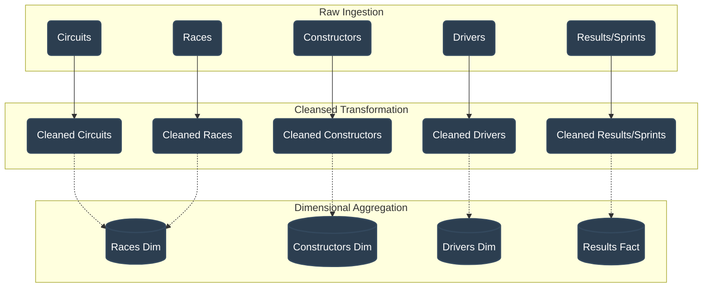
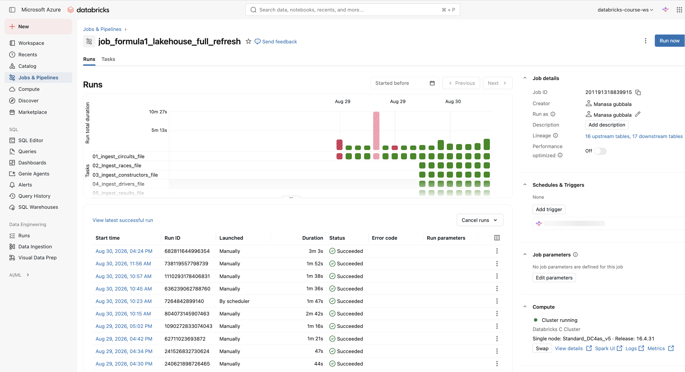
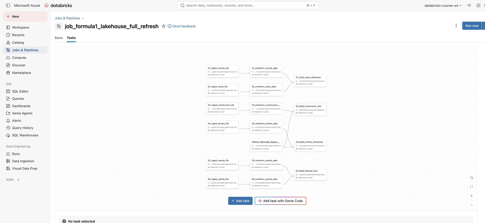
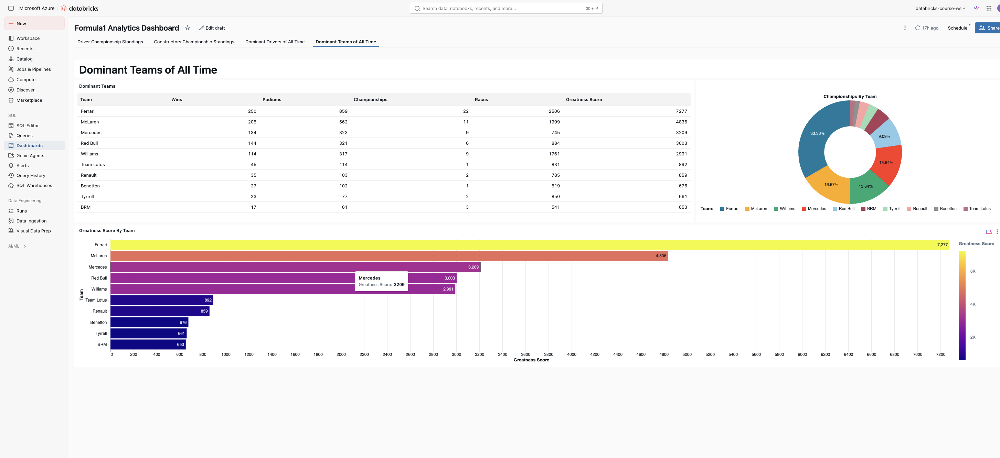
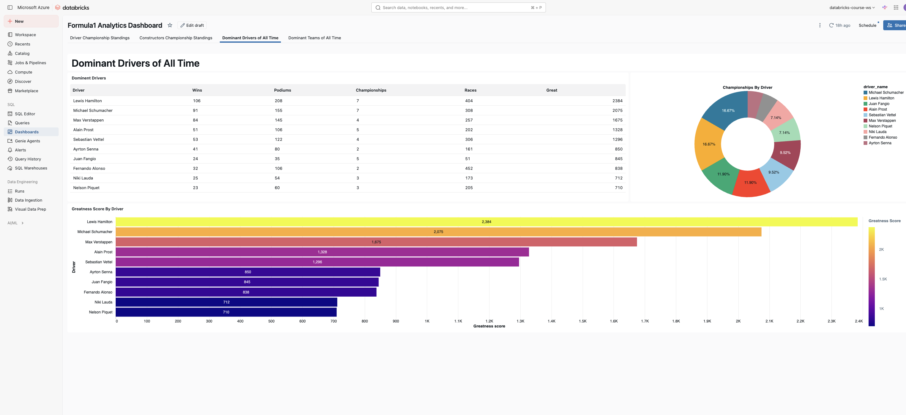
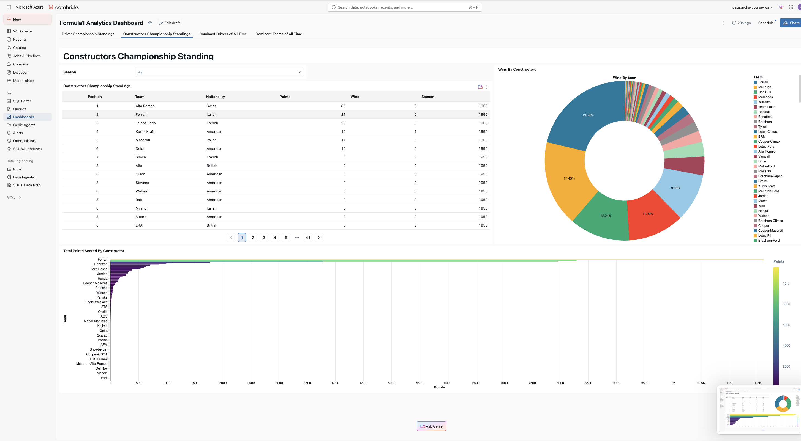
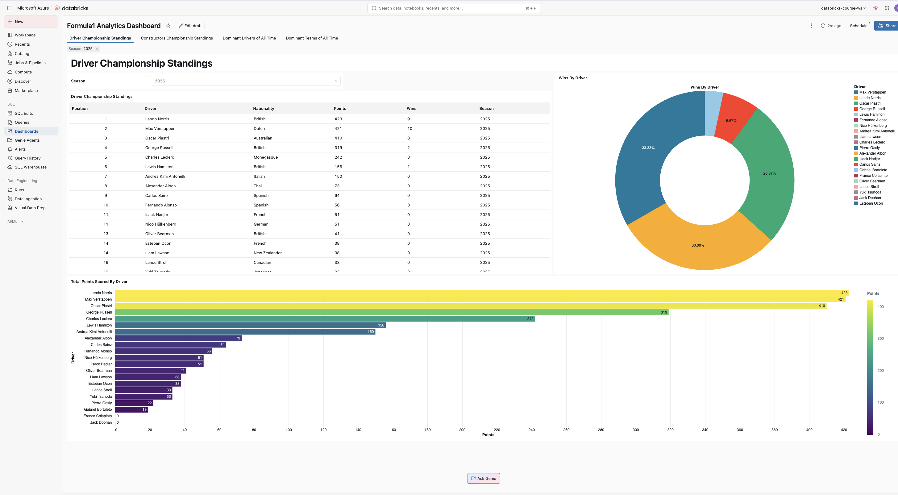

  <h1>🏎️ Formula 1 Data Engineering Project</h1>
  
<i>An End-to-End Azure Databricks Pipeline using the Medallion Architecture</i>

  
  
  
  
  

---

> **🚀 Advanced Exploration**: I have explored this project further and implemented **Incremental Data Loading** techniques in another repository. Please check out the advanced implementation here: [Formula1-project-incremental-load](https://github.com/Ganateja19/Formula1-project-incremental-load)

## 🏗️ Project Architecture & Data Flow

This project is built on the highly scalable **Medallion Architecture**, progressing raw files all the way to curated business-level aggregates.

```mermaid
graph LR
    %% Modern Canvas-Friendly Styling
    classDef source fill:#1e1e1e,stroke:#0078d4,stroke-width:2px,color:#fff,rx:5px,ry:5px;
    classDef bronze fill:#cd7f32,stroke:#8b4513,stroke-width:2px,color:#fff,rx:5px,ry:5px;
    classDef silver fill:#c0c0c0,stroke:#808080,stroke-width:2px,color:#111,rx:5px,ry:5px;
    classDef gold fill:#ffd700,stroke:#b8860b,stroke-width:2px,color:#111,rx:5px,ry:5px;
    classDef analytics fill:#00aba9,stroke:#006a68,stroke-width:2px,color:#fff,rx:5px,ry:5px;

    %% Nodes
    A[(fa:fa-cloud Azure ADLS<br/>Landing Zone)]:::source
    B[fa:fa-filter Bronze Layer<br/>Raw Data]:::bronze
    C[fa:fa-cogs Silver Layer<br/>Cleansed Data]:::silver
    D[fa:fa-database Gold Layer<br/>Aggregated Data]:::gold
    E[fa:fa-chart-bar Analytics<br/>Views & Reports]:::analytics

    %% Relationships
    A -->|JSON/CSV Ingestion| B
    B -->|PySpark Transforms| C
    C -->|Fact/Dim Modelling| D
    D -->|SQL Dashboards| E
```

<b>Click to expand detailed Data Lineage</b>

---

## 📂 Project Structure

A clean, modular directory structure ensuring maintainability and scalability across the data lifecycle.

| Directory | Purpose | Key Contents |
| :--- | :--- | :--- |
| ⚙️ **`00-common`** | Shared configurations and utilities | `environment_config`, `bronze_helpers` |
| 🛠️ **`01-setup`** | Environment initialization and DDL | Unity Catalog setups, External Locations, Schemas |
| 🥉 **`02-bronze`** | Landing to Bronze ingestion scripts | Raw delta table ingestion logic |
| 🥈 **`03-silver`** | Bronze to Silver transformations | Data cleansing, schema enforcement, null handling |
| 🥇 **`04-gold`** | Silver to Gold aggregations | Dimensional modeling (Facts & Dimensions) |
| 📊 **`05-analytics`** | Business insights and reporting | Standings SQL Views, Dominant Team Analysis |

---

## 🚀 Automated Workflows (Databricks Jobs)

The execution of this pipeline is entirely automated using Databricks Workflows, guaranteeing data reliability and timely processing.

#### 🔄 Data Ingestion and Transformation Workflow

#### 📈 Data Aggregation and Analytics Workflow

---

## 📊 Analytics Dashboards

We visualized the insights gathered from our Gold layer to produce interactive business-level dashboards.

  
  &nbsp;
  

  
  &nbsp;
  

---

## 🏆 Standings & Results

Detailed leaderboards constructed from our analytical views. 

#### 🏎️ Driver Standings

#### 🏎️ Constructor Standings

---

  <i>Built with ❤️ for Data Engineering & Formula 1</i>

